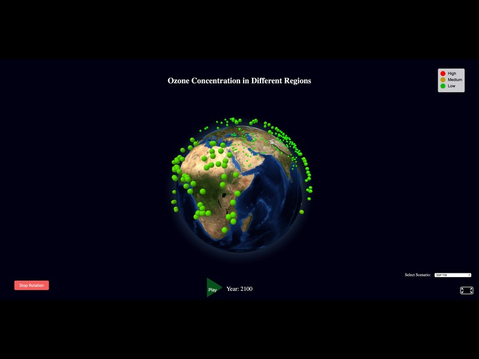

## aframe-globe-component

[](https://npmjs.org/package/aframe-globe-component)
[](https://npmjs.org/package/aframe-globe-component)

A 3D Globe component for data visualization using [A-Frame](https://aframe.io).

<p align="center">
  <a href="assets/Virtual_Globe1.jpeg"></a>
</p>


### Installation

#### Browser

Install and use by directly including the [browser files](dist):

```html
<head>
  <title>My A-Frame Scene</title>
  <script src="https://unpkg.com/aframe"></script>
  <script src="https://unpkg.com/aframe-globe-component"></script>
</head>

<body>
  <a-scene>
    <a-entity globe="points-data: [{ lat: 9.2, lng: 49.37 }, { lat: 23, lng: -125.4 }]"></a-entity>
  </a-scene>
</body>
```

#### npm

Install via npm:

```bash
npm install aframe-globe-component
```

Then require and use.

```js
require('aframe');
require('aframe-globe-component');
```


